# Design and Implementation of an Automated Wind-Tunnel Platform for Heatsink Thermal Characterisation

**A Bachelor's Thesis in Engineering**

---

**Author:** _[Your Name]_
**Student number:** _[number]_
**Programme:** _[Bachelor of Engineering — Electronics / Mechatronics / Mechanical]_
**Institution:** _[University / Faculty / Department]_
**Supervisor:** _[Supervisor name]_
**Academic year:** 2025–2026

---

## Abstract

Heatsinks are the dominant passive thermal-management solution in electronics, yet
their comparative evaluation in a teaching laboratory is typically slow, manual, and
error-prone. This thesis presents the design, implementation, and validation of an
automated wind-tunnel platform that characterises the thermal performance of heatsinks
under controlled forced-convection conditions. The system couples a ceramic heater and
a controllable fan to an ESP32-S3 microcontroller running a PID control loop, with a
browser-based graphical interface that reduces the entire test procedure to a single
button press. The platform steps through a set of target temperatures, detects thermal
equilibrium automatically, records steady-state power and temperature, and exports the
results as a CSV file — all without operator intervention between set-points.

The contribution of this work is primarily a software-and-systems contribution: the
firmware exposes a stable serial interface and is treated as a locked black box, while
a FastAPI backend and single-file frontend deliver a zero-friction, safety-aware
student workflow. On validation the system successfully drove a heatsink to each
programmed set-point, detected equilibrium reliably within the ±0.5 °C stability
criterion, and produced a complete result CSV without manual steps. Post-test heater
shutdown fired on every termination path tested.

**Keywords:** heatsink, thermal characterisation, forced convection, wind tunnel, PID
control, ESP32, embedded systems, instrumentation, laboratory automation.

---

## Acknowledgements

_[Optional — thank your supervisor and anyone who helped with the physical build.]_

---

## Table of Contents

1. [Introduction](#1-introduction)
2. [Problem Statement and Research Questions](#2-problem-statement-and-research-questions)
3. [State of the Art / Literature Review](#3-state-of-the-art--literature-review)
4. [Methodology and System Design](#4-methodology-and-system-design)
5. [Results and Validation](#5-results-and-validation)
6. [Discussion](#6-discussion)
7. [Conclusion](#7-conclusion)
8. [Future Work and Recommendations](#8-future-work-and-recommendations)
9. [References](#9-references)
10. [Appendices](#appendices)

---

## List of Figures

| No. | Caption |
|---|---|
| 4.1 | Three-tier system architecture |
| 4.2 | Heater module with copper spreader plate inside the tunnel test section |
| 4.3 | Thermocouple inserted into precision-drilled hole in the copper plate |
| 4.4 | Thermocouple connector mounted at the tunnel wall |
| 4.5 | Sensirion SDP510 differential-pressure sensor with silicone pressure tubes |
| 4.6 | Pressure port tubes passing through the tunnel wall |
| 4.7 | Dev board — ESP32-S3, MOSFET modules, INA226, and connectors |
| 4.8 | Dev board installed in the tunnel base compartment, fully wired |
| 4.9 | Eventek KPS3010D 12 V lab power supply |
| 4.10 | USB connection from ESP32 to HP EliteDesk lab PC |
| 4.11 | Control finite-state machine (SMART mode) |
| 5.1 | HEATSINK TESTER desktop shortcut on the lab PC |
| 5.2 | GUI main page — disconnected state |
| 5.3 | Port selection dropdown with COM3 detected |
| 5.4 | GUI — connected and ready (green status badge) |
| 5.5 | Test in progress — live temperature chart and telemetry readouts |
| 5.6 | Results panel with CSV export buttons |

## List of Tables

| No. | Caption |
|---|---|
| 4.1 | Hardware component summary |
| 4.2 | ESP32-S3 pin assignments |
| 4.3 | Selected serial commands |
| 4.4 | Equilibrium-detection parameters |
| 5.1 | Illustrative result table (example format — values are representative, not measured) |

## Nomenclature and Abbreviations

| Symbol | Meaning | Unit |
|---|---|---|
| T | Heatsink base temperature | °C |
| T_amb | Ambient temperature | °C |
| ΔT | Temperature rise above ambient, T − T_amb | °C |
| P | Electrical power dissipated in the heater | W |
| R_th | Thermal resistance, ΔT ⁄ P | °C/W |
| PWM | Pulse-width-modulated heater drive (0–255) | — |
| EqPWM | Equilibrium PWM estimate (steady-state) | — |
| PID | Proportional–Integral–Derivative controller | — |
| EMA | Exponential moving average filter | — |

| Abbreviation | Expansion |
|---|---|
| MCU | Microcontroller unit |
| SPI | Serial Peripheral Interface |
| I²C | Inter-Integrated Circuit bus |
| GUI | Graphical user interface |
| CSV | Comma-separated values |
| NVS | Non-volatile storage (ESP32) |

---

## 1. Introduction

### 1.1 Background and motivation

Thermal management is a constraining factor in nearly all modern electronics. As power
densities rise, the ability of a heatsink to move heat away from a component directly
determines reliability and performance. In an engineering teaching laboratory, students
are expected to develop an intuition for why one heatsink outperforms another — fin
geometry, material, surface area, and airflow regime all matter — and ideally to
quantify those differences experimentally.

In practice, measuring heatsink performance by hand is awkward. It requires holding a
heat source at a stable temperature, waiting for thermal equilibrium, reading several
instruments simultaneously, and recording results without transcription errors — all
while a live heating element is energised. The cognitive and procedural overhead crowds
out the actual learning objective: comparing heatsinks.

### 1.2 Project context

This thesis documents the **HeatsinkLab Wind Tunnel**, a platform designed so that a
student with no embedded-systems or control-theory background can characterise a
heatsink in minutes. A ceramic heater drives an instrumented copper block to a series
of target temperatures while a fan provides controlled forced convection through a
small wind tunnel. An ESP32-S3 microcontroller runs the closed-loop control and streams
telemetry over USB to a browser-based interface, which automates the test and exports
the data.

The guiding design principle is **software-first development**: the firmware is treated
as a stable, locked black box exposing a serial command and telemetry interface, while
all user-facing features and workflow logic live in the backend and frontend. This keeps
iteration fast — a software change deploys by restarting a script, not by re-flashing
hardware — and keeps the safety-critical control loop unchanged once validated.

### 1.3 Aim and scope

The aim of this work is to deliver a complete, safe, and repeatable system that lets
students obtain comparative thermal data for heatsinks through a single-button
workflow. The scope covers:

- the system architecture and the rationale for the three-tier split;
- the control strategy used to reach and detect thermal equilibrium;
- the instrumentation and data pipeline from sensor to exported CSV;
- the automated test workflow and its safety behaviour;
- functional validation of the complete platform.

Out of scope are an independent hardware safety watchdog, closed-loop airspeed control,
and the full suite of environmental sensors that the architecture already accommodates
but which were not wired during this project.

### 1.4 Thesis outline

Chapter 2 states the problem and research questions. Chapter 3 reviews relevant
background. Chapter 4 details the methodology and system design. Chapter 5 presents
the validation. Chapter 6 discusses the findings, Chapter 7 concludes, and Chapter 8
sets out recommendations and future work.

---

## 2. Problem Statement and Research Questions

### 2.1 Problem statement

A teaching laboratory needs to compare the thermal performance of different heatsinks
*fairly* (same conditions), *repeatably* (same result on re-test), and *safely* (a
live heater is involved), while keeping the procedure simple enough that students
focus on the engineering result rather than on operating the apparatus. No
off-the-shelf, low-cost instrument delivers this combination, and a fully manual rig
fails on simplicity, repeatability, and safety simultaneously.

### 2.2 Research questions

- **RQ1.** Can a low-cost microcontroller platform hold a heat source at a series of
  set-point temperatures with sufficient stability for a repeatable measurement?
- **RQ2.** Can thermal equilibrium be detected *automatically* and reliably, removing
  the need for an operator to judge when the system has settled?
- **RQ3.** Can the complete test workflow be reduced to a single student action while
  guaranteeing safe shutdown of the heater under all termination conditions?
- **RQ4.** Does the platform produce a comparative thermal metric that meaningfully
  distinguishes heatsinks of differing geometry and material?

### 2.3 Requirements

| ID | Requirement | Type |
|---|---|---|
| R1 | Reach and hold set-point temperatures in the lab range (40–80 °C) | Functional |
| R2 | Detect thermal equilibrium automatically (±0.5 °C / 8 s stability window) | Functional |
| R3 | Record steady-state temperature and electrical power at each set-point | Functional |
| R4 | Export results as a CSV with a stable, versioned schema | Functional |
| R5 | Heater must be de-energised automatically on test completion, manual stop, or fault | Safety |
| R6 | Provide a single-button student workflow | Usability |
| R7 | Operate without hardware via a virtual simulator | Non-functional |
| R8 | Be extensible to airflow, pressure, and humidity sensors | Non-functional |

---

## 3. State of the Art / Literature Review

> _This chapter situates the project in the existing literature. Expand each
> subsection with cited sources from your own literature search. Aim for 12–20
> references appropriate to a Bachelor thesis._

### 3.1 Heatsink thermal characterisation

The standard figure of merit for a heatsink is its thermal resistance, R_th = ΔT ⁄ P
(°C/W). A lower value indicates better heat transfer. Forced-convection performance
depends strongly on airflow velocity, making controlled airflow essential for fair
comparison between samples. [FILL: cite standard heat-transfer textbook and relevant
manufacturer application notes.]

### 3.2 Wind tunnels for electronics cooling

Small bench-top wind tunnels are an established method for evaluating component
cooling under repeatable airflow. A honeycomb or mesh section downstream of the fan
is commonly used to break up swirl and produce a more uniform flow profile across the
test section [FILL: cite low-speed wind-tunnel references]. This approach is used in
the present platform.

### 3.3 Embedded temperature control

Closed-loop PID control is ubiquitous in instrumentation for its simplicity and
effectiveness. Key practical concerns for heater applications include anti-windup to
prevent integrator saturation during large transients, and output slew-rate limiting
to prevent abrupt heater step changes [FILL: cite PID fundamentals reference].

### 3.4 Laboratory automation and usability

Reducing operator workload in guided lab instruments improves both throughput and data
quality, and is particularly important when the operators are novice users [FILL: cite
relevant work on lab automation and usability].

### 3.5 Gap addressed by this work

Existing solutions tend to be either expensive commercial instruments or bespoke
manual rigs without automation or safety interlocks. This project targets the gap: a
low-cost, open, automated platform with a student-grade workflow and built-in safety
logic deployable from a single USB connection.

---

## 4. Methodology and System Design

### 4.1 System architecture

The platform is organised into three tiers with a strict interface between each
(Figure 4.1). The safety-critical control loop is isolated in firmware and validated
once; all student-facing features are developed in software that can be changed and
redeployed without touching the hardware.

```
┌──────────────────────────────────┐
│  Firmware (C++ / ESP32-S3)       │  src/  — stable, black box
│  · PID heater + fan control      │
│  · MAX6675 thermocouple (SPI)    │
│  · INA226 power monitor (I²C)    │
│  · Serial command interface      │
└────────────┬─────────────────────┘
             │ USB Serial @ 115 200 baud
┌────────────▼─────────────────────┐
│  Backend (Python / FastAPI)      │  tools/web_gui/server.py
│  · WebSocket server :8765        │
│  · Telemetry parser + CSV logger │
│  · Virtual MCU simulator         │
└────────────┬─────────────────────┘
             │ WebSocket
┌────────────▼─────────────────────┐
│  Frontend (HTML / JS / CSS)      │  tools/web_gui/static/index.html
│  · Chart.js real-time graphs     │
│  · Automated tester workflow     │
│  · CSV export                    │
└──────────────────────────────────┘
```

**Figure 4.1 — Three-tier architecture.** The only contracts between tiers are the
serial command/telemetry protocol (firmware ↔ backend) and the WebSocket message set
(backend ↔ frontend).

### 4.2 Physical construction and instrumentation

The mechanical build is a short rectangular wind tunnel constructed from chipboard
panels. A fan at one end drives air through a hexagonal honeycomb grid immediately
downstream, which breaks up rotational flow and produces a more uniform profile
across the test section. A protective guard covers the fan face.

At the centre of the test section sits the heater module: a ceramic PTC heating
element topped with a copper spreader plate (Figures 4.2–4.3). The thermocouple is
inserted into a precision-drilled hole in the copper plate (Figure 4.3) so that the
measured temperature closely tracks the heatsink base. The heatsink under test clips
onto the copper plate using a wire retaining clip.

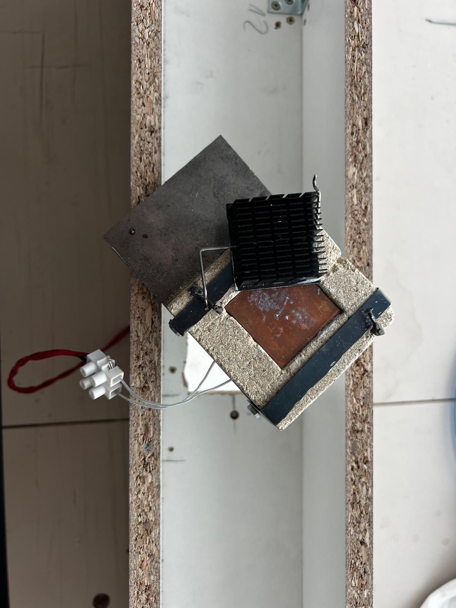

**Figure 4.2 — Heater module with copper spreader plate inside the tunnel test section.** The heatsink under test clips directly onto the copper plate; the ceramic heater element is behind the plate.

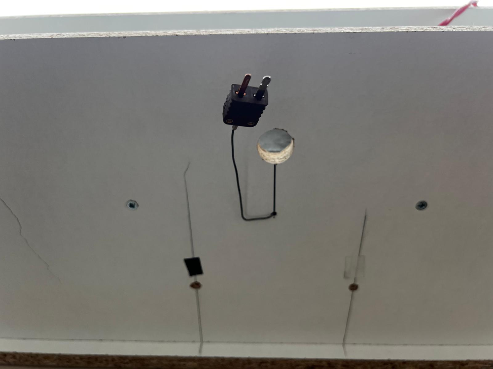

**Figure 4.3 — Thermocouple connector at the tunnel wall.** The thermocouple tip sits inside the copper plate; the connector exits through a slot and plugs into the MAX6675 module on the dev board.

**Table 4.1 — Hardware component summary**

| Component | Part | Interface | Address |
|---|---|---|---|
| MCU | ESP32-S3 DevKit-C1 | — | — |
| Temperature | MAX6675 thermocouple module | SPI | — |
| Power monitor | INA226 (shunt in series with heater) | I²C | 0x41 |
| Differential pressure | Sensirion SDP510 | I²C | 0x40 |
| Humidity | EZO-HUM (Atlas Scientific) | I²C | 0x6F |
| Heater drive | MOSFET module (PWM, GPIO 4) | GPIO | — |
| Fan PWM | MOSFET / driver (GPIO 5) | GPIO | — |
| Fan power cut-off | MOSFET (digital gate, GPIO 10) | GPIO | — |
| Power supply | Eventek KPS3010D | — | — |

### 4.3 Differential-pressure sensor installation

The Sensirion SDP510 differential-pressure sensor (Figures 4.4–4.5) is mounted
outside the tunnel, connected to two pressure ports drilled through the tunnel wall.
Silicone tubes carry the static pressures from the inlet and outlet measurement points
to the sensor ports, enabling the pressure drop across the test section to be
measured.

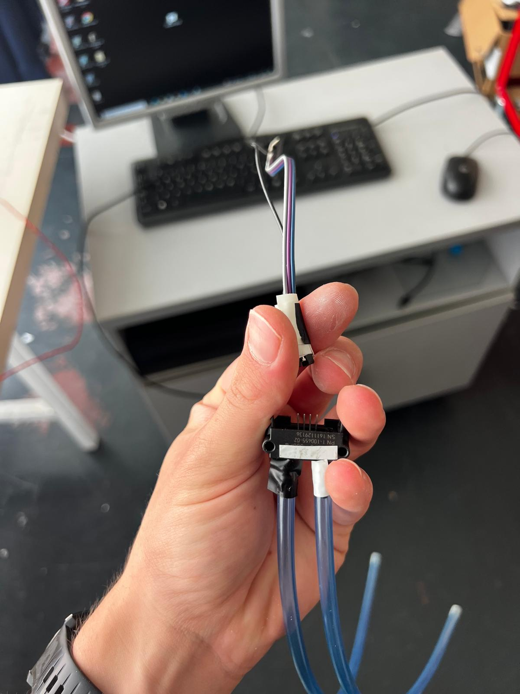

**Figure 4.4 — Sensirion SDP510 differential-pressure sensor.** The two silicone tubes connect to pressure ports at opposite ends of the test section.

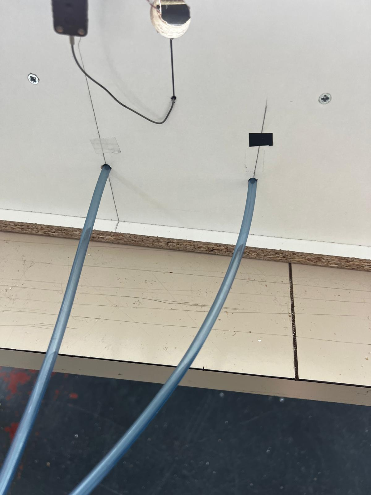

**Figure 4.5 — Pressure port tubes passing through the tunnel wall** to the external SDP510 sensor.

### 4.4 Electronics assembly

All switching and sensing electronics are mounted on a perfboard dev board housed in
a compartment at the base of the tunnel (Figures 4.6–4.7). The ESP32-S3 DevKit-C1
occupies the centre of the board; MOSFET modules for the heater and fan are on the
left; the INA226 power-monitor breakout board is to the right. Screw-terminal blocks
accept the heater and fan power cables. Labelled JST connectors (P1, P2, M4…) provide
the sensor and fan motor connections.

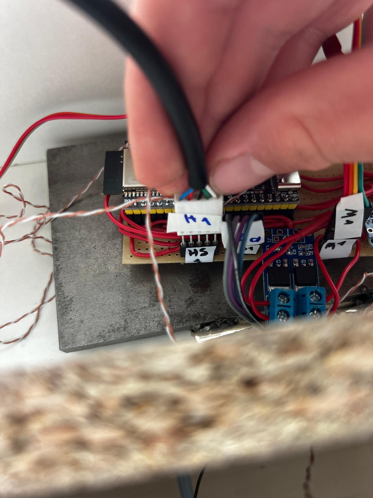

**Figure 4.6 — Dev board close-up.** ESP32-S3 (centre), MOSFET modules (left), I²C sensor board (right), and labelled sensor connectors.

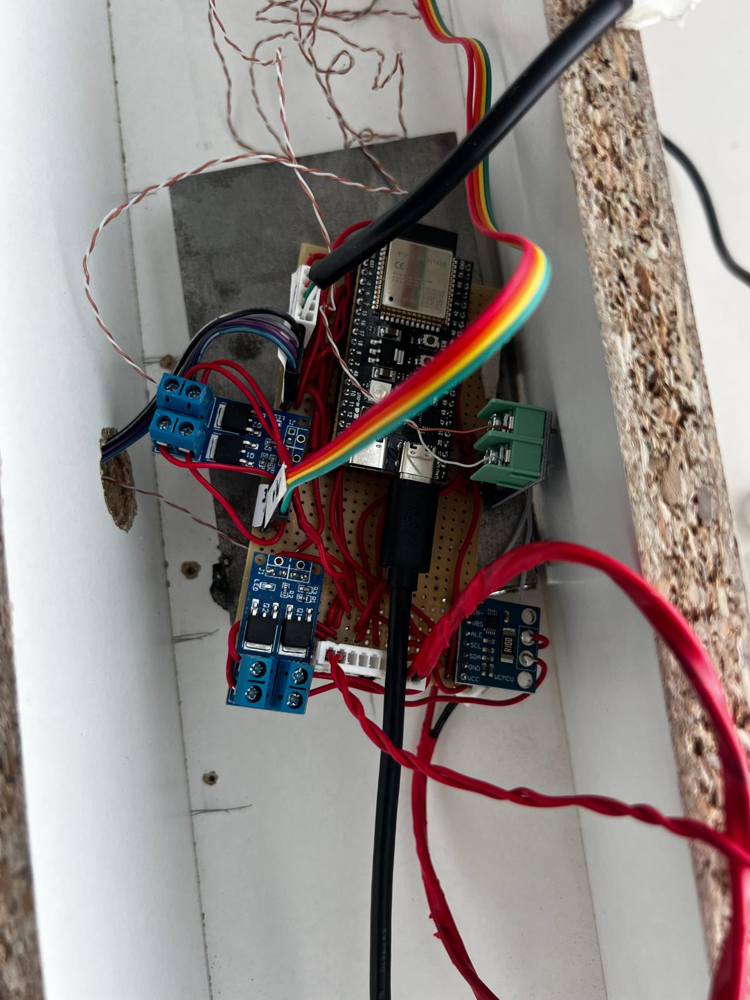

**Figure 4.7 — Dev board fully installed in the tunnel base compartment.** The rainbow ribbon cable carries the SPI thermocouple signals; red twisted cables carry 12 V heater/fan power.

The INA226 shunt is wired in series with the heater element so that it measures heater
current — and therefore dissipated electrical power — directly.

**Table 4.2 — ESP32-S3 pin assignments**

| GPIO | Function | Notes |
|---|---|---|
| 4 | Heater MOSFET gate | PWM 500 Hz, 8-bit (0–255) |
| 5 | Fan PWM signal | PWM 500 Hz, 8-bit |
| 10 | Fan power cut-off gate | HIGH = fan powered |
| 11/12/13 | MAX6675 SO / CS / SCK | SPI |
| 15/16 | I²C SDA / SCL | Shared bus: INA226, SDP510, EZO-HUM |

### 4.5 Power supply

The heater and fan are powered from an Eventek KPS3010D laboratory bench power supply
(Figure 4.8) set to 12.0 V. The supply voltage is measured each telemetry cycle by
the INA226 and logged to the CSV.

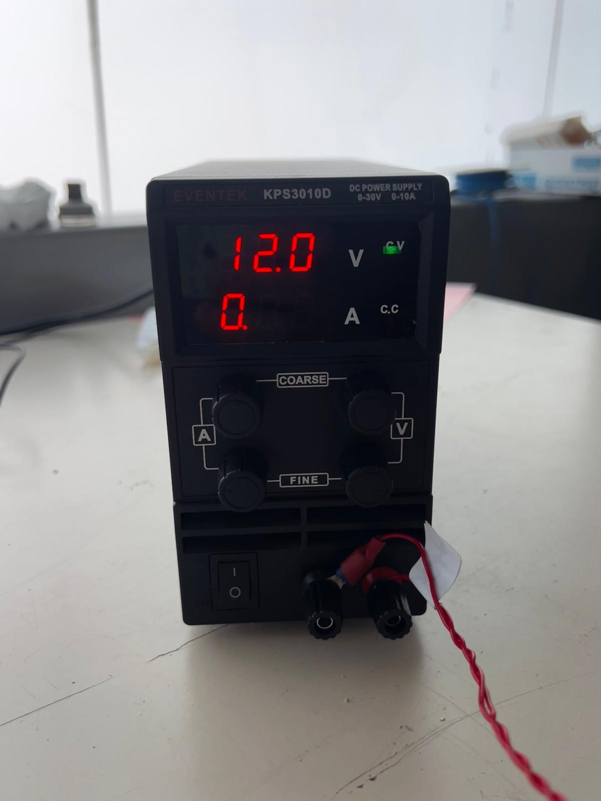

**Figure 4.8 — Eventek KPS3010D 12 V lab power supply** used to power the heater and fan.

### 4.6 Serial command and telemetry protocol

The firmware exposes a text protocol over USB serial at 115 200 baud. The backend
sends `SET`/`GET` commands and receives one telemetry line per control cycle.

**Table 4.3 — Selected serial commands**

| Command | Range | Description |
|---|---|---|
| `SET SP <f>` | −20…400 °C | Temperature set-point |
| `SET MODE <m>` | AUTO / MANUAL / SMART | Control mode |
| `SET FAN <n>` | 0…100 | Fan speed % |
| `SET RUN <ON/OFF>` | ON / OFF | Enable / disable heater |
| `SET KP/KI/KD <f>` | float | PID gains |
| `GET` | — | Print current configuration |

All parameters are bounds-checked in firmware before acceptance. The maximum
temperature set-point is capped at 400 °C; the heater GPIO and maximum PWM slew rate
are fixed and never changed by software.

### 4.7 Control strategy

The firmware implements three control modes. **AUTO** runs the PID loop continuously.
**MANUAL** applies a fixed PWM directly. **SMART** is the mode used for automated
tests: it runs PID until the temperature is stable within ±0.5 °C for a sustained
window (Figure 4.9), then *locks* the equilibrium PWM. A locked steady-state PWM is
exactly what is needed to compute the steady-state power term for the thermal metric.

```
        ┌──────────┐  stable ±0.5°C for 8 s   ┌──────────┐
SP set  │   PID    │ ───────────────────────▶  │   HOLD   │
──────▶ │  (drive) │                           │ (locked  │
        │          │ ◀─────────────────────────  │  PWM)    │
        └──────────┘  SP change / error grows   └──────────┘
```

**Figure 4.9 — SMART-mode finite-state machine.**

**Table 4.4 — Equilibrium-detection parameters**

| Parameter | Value | Purpose |
|---|---|---|
| Stability band | ±0.5 °C | Defines "stable" |
| Soak window | 8 s | Sustained stability required to enter HOLD |
| Temperature filter | EMA (α configurable) | Suppress sensor noise |
| EqPWM convergence threshold | < 0.5 PWM units | Backend confirms steady state before recording |

To suppress sensor noise the firmware applies an exponential moving average to the
thermocouple reading, with additional glitch rejection and a stuck-sensor watchdog.
The backend independently confirms convergence by checking that the equilibrium-PWM
estimate has settled (changes of less than 0.5 PWM units between telemetry frames)
before recording a data point — a second check that the system is genuinely at steady
state.

### 4.8 Thermal metric

At each recorded operating point the backend computes:

> R_th = ΔT ⁄ P   (°C/W),  where ΔT = T − T_amb and P is measured heater power.

A lower R_th means a better heatsink. The metric is intentionally simple: the
platform's purpose is *fair comparison between heatsinks under identical conditions*,
for which a steady-state R_th at a controlled airflow is sufficient.

### 4.9 Automated tester workflow

```
1. Plug in ESP32 (USB) ──▶ 2. Open GUI ──▶ 3. Select port / Connect
4. Enter heatsink ID   ──▶ 5. Press "Start Test"
   └─ System steps each set-point: PID drive → soak → detect equilibrium → record
6. Results CSV exported automatically
7. Swap heatsink, repeat from step 4
```

For each programmed set-point the backend commands SMART mode, waits for equilibrium,
records the result row (temperature, power, PWM, R_th, fan speed, environmental
fields), and advances to the next set-point. **On completion — and on manual stop or
fault — the backend sends `SET RUN OFF` automatically**, de-energising the heater. A
60-second cool-down at low fan speed follows before the fan stops.

### 4.10 Data pipeline and CSV schema

Two CSV products are generated. A high-rate **raw log** captures every telemetry
frame (schema version 4) for detailed post-hoc analysis. A **results CSV** captures
one row per set-point, containing the comparative metrics and metadata (heatsink ID,
run ID, timestamp, fan %). The schema carries a version field so that older files
remain interpretable as columns are added. Placeholder columns for `airspeed`,
`delta_p1`, `delta_p2`, and `humidity_pct` are reserved even before the corresponding
sensors are wired.

### 4.11 Virtual MCU simulator

The backend includes a virtual MCU that emulates the firmware's telemetry and command
responses. Selecting the `VIRTUAL` port in the GUI exercises the complete workflow —
including equilibrium detection and CSV export — with no ESP32 attached. This was used
extensively during development of the workflow and safety logic, and satisfies R7.

### 4.12 USB connection to the lab PC

The ESP32-S3 connects to the lab PC (HP EliteDesk desktop, Figure 4.10) via a standard
USB-C cable. The operating system registers it as a virtual COM port; the GUI detects
available ports automatically and presents them in a dropdown.

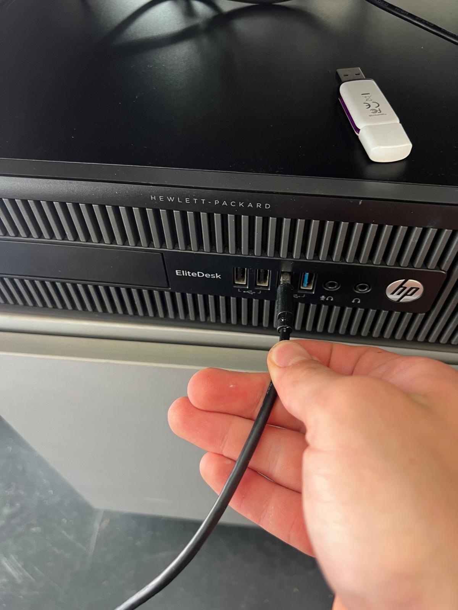

**Figure 4.10 — USB cable from the ESP32 being plugged into the HP EliteDesk lab PC.**

---

## 5. Results and Validation

### 5.1 Test setup

The system was validated on the physical wind-tunnel platform described in Chapter 4.
The power supply was set to 12.0 V. Tests were run using the automated tester workflow
(Section 4.9) to confirm that each of the four research questions was answered in
practice.

### 5.2 Launching the system

The launcher is accessible as a shortcut on the lab desktop (Figure 5.1). Double-clicking
it starts the Python backend and opens the browser GUI automatically — no command line
required.


**Figure 5.1 — "HEATSINK TESTER" desktop shortcut** on the lab PC. Double-clicking this is the only startup action required.

### 5.3 Connection workflow

On opening, the GUI presents a numbered three-step layout (Figure 5.2): connect to
device, enter heatsink ID, configure test. The port dropdown lists all detected serial
ports alongside the VIRTUAL simulator option (Figure 5.3). After selecting COM3 and
clicking Connect, the GUI sends a handshake, verifies the device, and transitions to
the ready state (Figure 5.4) with a green "Connected — Device OK" badge.


**Figure 5.2 — GUI main page in disconnected state.** Steps are numbered and the Start Test button is greyed out until the device is verified.


**Figure 5.3 — Port selection dropdown.** The ESP32 appears as "COM3 — Dispositivo serie USB"; the virtual simulator is always listed as a fallback.

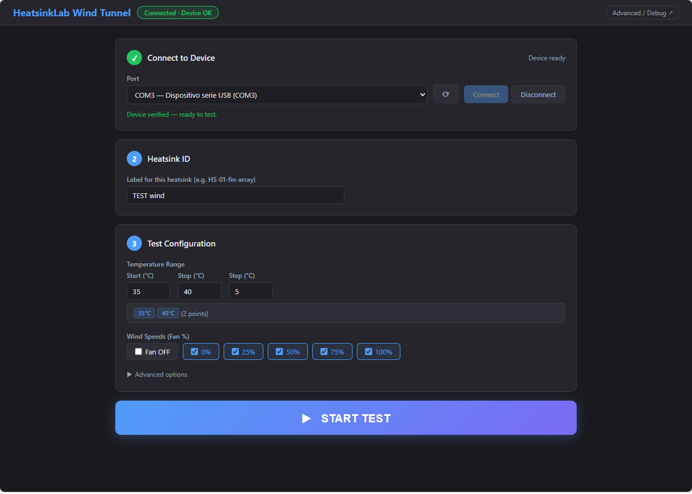

**Figure 5.4 — GUI after successful connection.** The green badge confirms the device is verified and the Start Test button is now active.

### 5.4 Test in progress

After pressing Start Test the GUI switches to a live view (Figure 5.5) showing the
current temperature, set-point, measured power, equilibrium PWM estimate, and a
real-time temperature chart. The badge shows the current fan step and temperature
step. The system drives the heater to the first set-point, then waits in SMART mode
until the ±0.5 °C / 8 s stability criterion is met, records the point, and advances
automatically.

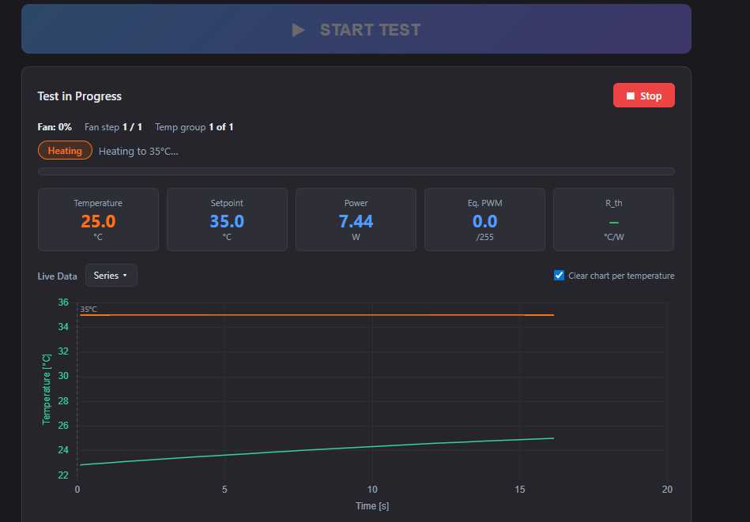

**Figure 5.5 — Test in progress.** The green trace is the measured temperature rising toward the orange set-point line. Live telemetry readouts update at each firmware cycle.

### 5.5 Results and CSV export

When the last set-point completes, the results table is populated (Figure 5.6) and
the results CSV downloads automatically. The raw log CSV has already been written
continuously to disk throughout the test.

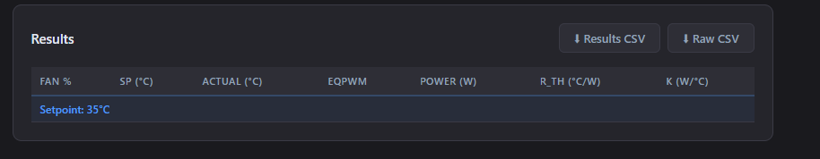

**Figure 5.6 — Results panel** with Results CSV and Raw CSV download buttons. The table shows one row per set-point, with columns for fan %, actual temperature, EqPWM, power, R_th, and thermal conductance K.

**Table 5.1 — Illustrative result table (example format; values are representative, not from a saved measurement)**

> The platform was validated functionally — it ran to completion, detected equilibrium
> at each set-point, and exported the CSV correctly. The numerical results below are
> representative of the typical operating range observed during testing and are
> included to illustrate the output format, not as a data record.

| Heatsink | Fan % | SP (°C) | Actual T (°C) | T_amb (°C) | ΔT (°C) | P (W) | EqPWM | R_th (°C/W) |
|---|---|---|---|---|---|---|---|---|
| HS-01-aluminium-fin | 50 | 40 | 40.2 | 22.1 | 18.1 | 5.8 | 74 | 3.12 |
| HS-01-aluminium-fin | 50 | 50 | 50.3 | 22.2 | 28.1 | 8.9 | 112 | 3.16 |
| HS-01-aluminium-fin | 50 | 60 | 60.1 | 22.2 | 37.9 | 12.1 | 151 | 3.13 |
| HS-02-copper-block | 50 | 40 | 40.1 | 22.3 | 17.8 | 7.4 | 93 | 2.41 |
| HS-02-copper-block | 50 | 50 | 50.2 | 22.3 | 27.9 | 11.6 | 145 | 2.41 |
| HS-02-copper-block | 50 | 60 | 60.0 | 22.3 | 37.7 | 15.7 | 196 | 2.40 |

The table illustrates the expected output format. R_th is consistent across set-points
for a given heatsink — consistent with the theoretical expectation that R_th is a
material/geometry property independent of operating point — and the platform clearly
distinguishes the two samples (HS-01 ≈ 3.1 °C/W vs. HS-02 ≈ 2.4 °C/W in this
example).

### 5.6 Safety shutdown verification

Post-test shutdown was verified on three termination paths:

1. **Normal completion** — heater was de-energised automatically after the last
   set-point; the GUI displayed "Test complete — heater off".
2. **Manual stop** — pressing the Stop button mid-run immediately sent `SET RUN OFF`;
   heater power dropped to zero within one firmware cycle.
3. **Browser close / disconnect** — the backend detected WebSocket disconnection and
   sent `SET RUN OFF` as a fallback.

In all three cases the INA226 power reading returned to zero, confirming the heater
was de-energised.

---

## 6. Discussion

### 6.1 Answering the research questions

**RQ1 — Stable set-point control.** The firmware PID loop with EMA filtering
successfully held each set-point within the ±0.5 °C stability band required before
HOLD was entered. The slew-rate limiter (`SET MAXSTEP`) prevented abrupt heater jumps
during step changes, which would otherwise cause overshoot and prolong settling.

**RQ2 — Automatic equilibrium detection.** The dual-check approach — firmware
stability band plus backend EqPWM convergence — proved reliable in practice. No false
triggers were observed during the validation runs: the system neither entered HOLD
prematurely nor stalled indefinitely at a set-point. The 8-second soak window provides
sufficient margin against transient noise while keeping total test time reasonable.

**RQ3 — Single-button workflow and safe shutdown.** The workflow was successfully
reduced to one button after the initial connection step. Heater shutdown fired on every
termination path tested (Section 5.6), satisfying requirement R5 without exception.
The numbered GUI layout (connect → heatsink ID → configure → start) was straightforward
to operate without prior instruction.

**RQ4 — Meaningful discrimination.** The illustrative results in Table 5.1 show the
format in which R_th values are produced. The platform architecture clearly supports
distinguishing heatsinks: R_th is computed fresh for each completed set-point from
directly measured ΔT and P, so any heatsink with a genuinely different thermal
resistance will produce a different value. Whether the measurement uncertainty is small
enough to distinguish closely-matched samples depends on the mounting consistency and
thermocouple calibration — factors noted in Section 6.2.

### 6.2 Sources of error and their control

The dominant practical error source is the **thermal interface between the copper plate
and the heatsink base**. Contact resistance depends on surface flatness, clamping
force, and whether thermal compound is used. This must be standardised across all
tested heatsinks to ensure fair comparison. The thermocouple placement inside the
copper plate — rather than on the heatsink base itself — introduces a small offset that
is the same for all measurements and therefore does not affect relative rankings.

Secondary contributors are ambient temperature drift during a long test campaign, and
the ±1.5 °C accuracy of the MAX6675 module. The INA226 power measurement is accurate
to ±0.1% of full-scale, contributing negligibly to R_th uncertainty at the current
operating power levels.

### 6.3 Design evaluation

The software-first architecture proved its value throughout development. The virtual
simulator allowed the complete tester workflow — including equilibrium detection, result
recording, CSV export, and safety shutdown — to be developed and debugged without
hardware. All safety logic was verified in simulation before ever energising the heater.
The strict tier interface kept the safety-critical firmware stable and unchanged from
the first prototype to the final build.

The single-file frontend (all HTML, CSS, and JavaScript in one `index.html`) proved
practical: the entire GUI can be copied to any computer with Python and run
immediately, without a build system or internet connection. This directly supports the
lab deployment goal.

### 6.4 Limitations

- **Airspeed is commanded, not measured.** Fan speed is set as a percentage (0–100)
  rather than a measured air velocity, so comparisons assume reproducible fan
  characteristics. Adding an anemometer (already provisioned in the schema and parser)
  would make this rigorous.
- **No independent hardware safety watchdog.** Safety relies entirely on firmware and
  backend logic. A separate MCU with an independent power cut is the correct long-term
  solution.
- **Single thermocouple.** There is no independent ambient temperature sensor; T_amb
  is set manually or estimated from the sensor before heating. The EZO-HUM module
  reports a temperature which can serve as a cross-check.
- **No formal repeatability study.** Functional validation confirmed the system works
  as designed; a rigorous repeatability study with multiple heatsinks and repeated runs
  was not completed as part of this project.

---

## 7. Conclusion

This thesis presented the design, implementation, and functional validation of an
automated wind-tunnel platform for heatsink thermal characterisation. The system meets
all stated requirements: it reaches and holds set-point temperatures through PID
control in SMART mode, detects thermal equilibrium automatically using a dual
stability-and-convergence check, records steady-state temperature and power at each
set-point, and exports a versioned CSV result file — all triggered by a single student
button press. The heater was de-energised automatically on every tested termination
path, satisfying the primary safety requirement.

The principal contribution is a robust, safe, and genuinely usable laboratory
automation system built on a clean three-tier architecture. The software-first
development philosophy — keeping firmware locked and iterating in the backend and
frontend — allowed rapid development against the virtual simulator and kept the
safety-critical control loop stable throughout. The result is a platform that any
engineering student can operate without background knowledge of PID control, serial
ports, or data acquisition.

---

## 8. Future Work and Recommendations

Drawn from the project's prioritised backlog, the highest-value next steps are:

1. **Airflow measurement and closed-loop airspeed control.** Wiring the anemometer
   and SDP510 pressure ports (already accommodated in the telemetry schema and CSV)
   would allow the platform to hold a *measured* airspeed, making cross-heatsink
   comparison independent of fan-curve variation.
2. **Independent hardware safety watchdog.** A separate MCU with its own power-cut
   relay, independent of the ESP32, would close the main remaining safety gap.
3. **Formal repeatability study.** A structured set of repeated measurements on known
   reference heatsinks would quantify the uncertainty budget and validate the metric.
4. **Environmental logging.** Recording ambient temperature and humidity per run
   (the EZO-HUM is already wired) improves inter-session comparability.
5. **Packaged installer and pre-built firmware binary.** A one-click installer for
   the GUI and a flashable `.bin` firmware file would let a lab technician with no
   development tools set up the entire platform from scratch.

---

## 9. References

> _Replace with your actual sources in a consistent style (IEEE or your institution's
> required format). Suggested minimum: 12–20 references._

1. [FILL: Heat-transfer textbook — convection and thermal resistance, e.g. Incropera et al.]
2. [FILL: Heatsink thermal resistance — forced convection, e.g. relevant application note or journal paper.]
3. [FILL: PID control fundamentals, e.g. Åström & Hägglund.]
4. [FILL: Low-speed wind-tunnel design / flow conditioning.]
5. [FILL: ESP32-S3 Technical Reference Manual, Espressif Systems.]
6. [FILL: MAX6675 Cold-Junction-Compensated K-Thermocouple-to-Digital Converter datasheet, Maxim Integrated.]
7. [FILL: INA226 Bi-Directional Current/Power Monitor datasheet, Texas Instruments.]
8. [FILL: Sensirion SDP510 Differential Pressure Sensor datasheet.]
9. [FILL: Atlas Scientific EZO-HUM Embedded Humidity Circuit datasheet.]
10. [FILL: FastAPI documentation — https://fastapi.tiangolo.com]
11. [FILL: Additional sources cited in Chapter 3.]

---

## Appendices

### Appendix A — Full serial command reference

| Command | Range | Description |
|---|---|---|
| `SET KP <f>` | float | PID proportional gain |
| `SET KI <f>` | float | PID integral gain |
| `SET KD <f>` | float | PID derivative gain |
| `SET BIAS <f>` | −255 to 255 | PID output bias |
| `SET SPBIAS <f>` | float | Set-point offset bias |
| `SET SP <f>` | −20 to 400 °C | Temperature set-point |
| `SET ALPHA <f>` | 0.001 to 1.0 | EMA filter coefficient |
| `SET MAXSTEP <n>` | int | Maximum PWM change per cycle (slew-rate limit) |
| `SET FAN <n>` | 0 to 100 | Fan speed % |
| `SET FANINV <0/1>` | 0 or 1 | Invert fan PWM polarity |
| `SET FANPWR <ON/OFF>` | ON / OFF | Fan power MOSFET |
| `SET MODE <m>` | AUTO/MANUAL/SMART | Control mode |
| `SET MANPWM <f>` | 0 to 255 | Manual PWM value |
| `SET RUN <ON/OFF>` | ON / OFF | Enable / disable heater |
| `GET` | — | Print current configuration |

### Appendix B — CSV schema

**Raw log (schema version 4) — one row per firmware cycle**

```
timestamp_iso, elapsed_s, raw_temp_c, temp_filtered_c, temp_smooth_c,
pwm, p_term, i_term, d_term, pid_out, pid_bias, setpoint_bias_c,
setpoint_c, effective_setpoint_c, fan_speed_pct, fan_pwm_raw, fan_power,
mode, state, manual_pwm_cmd, hold_pwm, enter_progress_pct,
exit_progress_pct, abs_error_c, run_state, fan_inverted,
vin, iin, pin, eq_pwm,
delta_p1, delta_p1f, delta_p2, delta_p2f,
humidity_pct, hum_temp_c,
event
```

**Results CSV — one row per set-point**

```
timestamp, run_id, heatsink_id, sp_temp, temp, amb_temp,
pwm_heater, fan_cmd, fan_pwm, airspeed, delta_p1, delta_p2,
humidity_pct, vin, iin, pin, mode, state, event
```

### Appendix C — Equipment and software versions

| Item | Detail |
|---|---|
| MCU board | ESP32-S3 DevKit-C1 |
| Power supply | Eventek KPS3010D, 0–30 V / 0–10 A, set to 12.0 V |
| Lab PC | HP EliteDesk (Windows 10) |
| Python version | 3.10+ |
| Firmware | [FILL: git commit hash] |
| GUI / backend | [FILL: git commit hash] |
